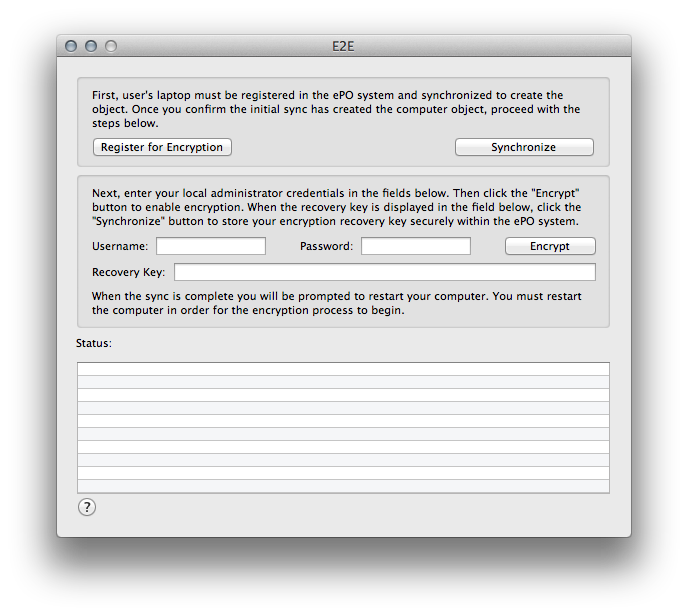

>#EscrowtoEPO (E2E)
-----

#Introduction
EscrowtoEPO is a project born out of the behavioral inconsistency of McAfee's EEMac FDE (full disk encryption) solution in (my) enterprise. McAfee's EEMac FDE product is somewhat incomplete in its feature-set, specifically requiring an enterprise to block software updates to encrypted Macs in order to maintain the integrity of the encryption product. It combines information shared across the Mac Enterprise (now MacAdmins) community of administrators regarding the escrow of FileVault 2 recovery keys to existing enterprise systems. EscrowtoEPO combines several ideas specifically:

1. Christopher Silvertooth's escrow of FileVault recovery keys to Active Directory (and accompanying scripts).
2. Patrick Gallagher's installation (more specifically, the usage of custom properties in ePO) of McAfee's ePO product.
3. My own Syncafee project found at http://github.com/loyaltyarm/mac
4. Rich Trouton's FileVault 2 Status scripts

See the references section for more info on these projects.

#Overview
EscrowtoEPO is an ApplescriptObjC application that allows the a user to enable FileVault 2 full-disk encryption, and provides a mechanism (the application's function) to synchronize the recovery key as a custom machine property back to your McAfee ePO environment. This ensures that the recovery key safely resides on a system built for retaining security policies (or solely supported/invested in by your company) and other client security information and allows enterprises the ability to leverage Apple's FDE solution. The recovery key used can be individual, which allows the administrator the ability to manage a recovery key that is different for every machine. In environments where users are administrators, once FileVault 2 is enabled users can manage additional users added to the machine via System Preferences. In non-users-as-admins environments, the usage of configuration profiles can assist administrators in deploying encrypted systems in this manner.

#PreRequisites/Requirements
1. McAfee's ePO product (environment infrastructure and client)
2. OS X Mountain Lion 10.8

#Future Enhancements
1. Convert to ObjC/ARC (application currently uses GCC memory management with ASOC)
2. Inclusion of NSPopover element for user information tasks
3. Improved text validation of user input fields--potentially have users validated or read from "dscl task at first launch"

#Acknowledgements and References
1. Documentation of FV2 Encryption configuration options as well as FileVault 2 Status scripts - [Rich Trouton](http://derflounder.wordpress.com/)
2. FV2 Escrow to AD/OD scripts and workflows/documentation - 
[Christopher Silvertooth] (http://musings.silvertooth.us/2012/09/filevault-key-escrow-version-2-0-mountain-lion-only/)
3. Get User Details (ePO Custom Properties) - [Patrick Gallagher](https://github.com/patgmac/scripts/blob/master/bash/McAfee_getUsersDetails.sh)

---Thanks guys!---

#Version History
1.0
Initial Release

1.1
--Addition of FV2 Status scripts assigned as LaunchDaemon to report on the status (RunAtLoad and Once every 24 hours)

1.2
--Added alert and check for custom property setting failure
--Update logging to be more descriptive in certain areas

1.3
--After receiving an update to the ePO server manager, I noticed that McAfee ePO server console was no longer displaying custom properties singularly, if they were set at different times. "After contacting support, I was told they changed application functions to match the documentation." Prior E2E functionality had the application enable FileVault and set the recovery key, then sync it to the server as CustomProp1. Now, due to the change from McAfee, CustomProp1 is overwritten on the server each time an update to the CustomProps.xml file is noticed during sync. This caused the status script to overwrite CustomProp1 as blank when it synced the encryption status back to the ePO server. As a result, a regular expression was added to the status script to check for the recovery key once it has been set, reassign it at as a custom property, and then initiate a sync.
--Also edited the status script to change permissions on the McAfee files so they could be edited and change back at the end. This keeps the recovery key out of Console and other places since the status script is now checking the recovery key as described above.

1.4
--Updated status script to set variables first. Removed checks to status script for conditional syncing and moved the conditionals to the variable setting.

#License
Copyright 2013 Nick Cobb (contact - loyaltyarm@gmail.com)

See LICENSE included in repo
